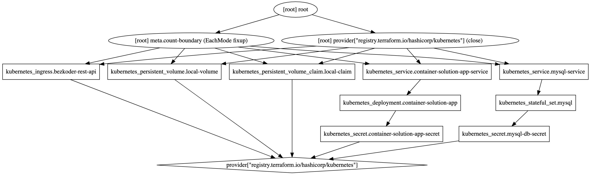
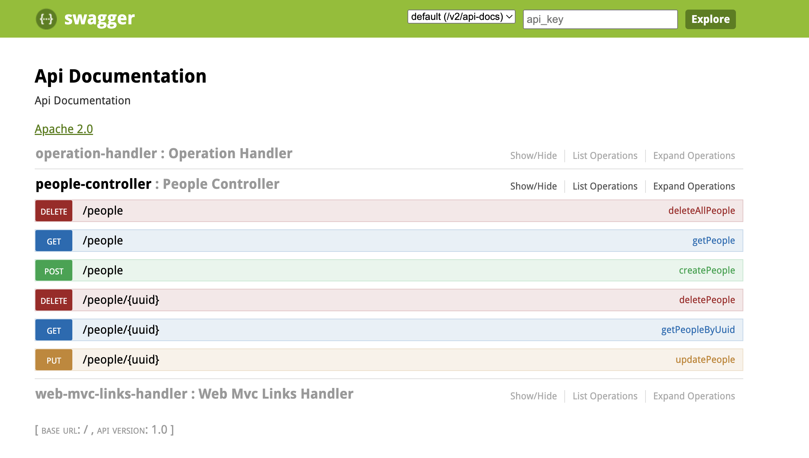
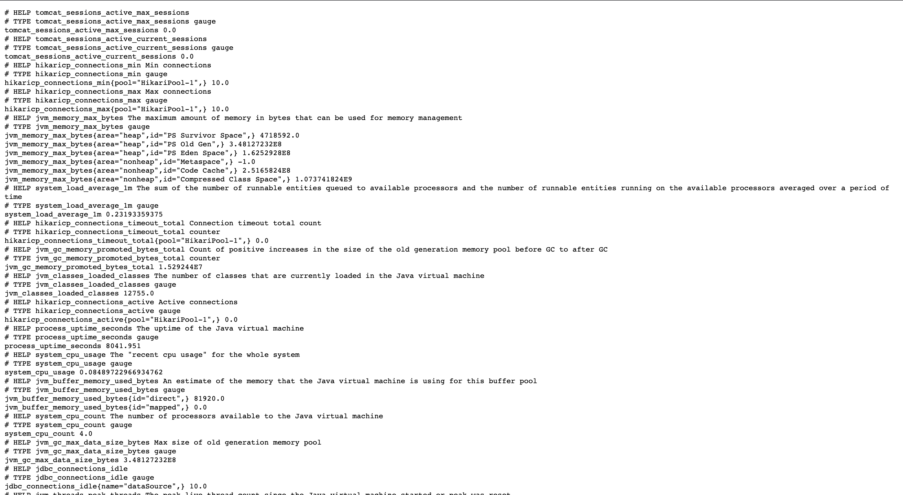
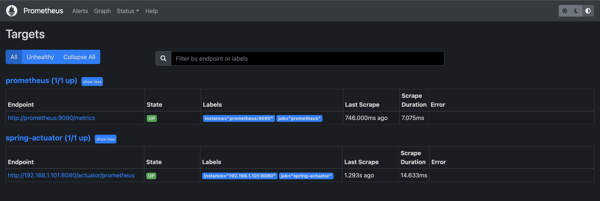
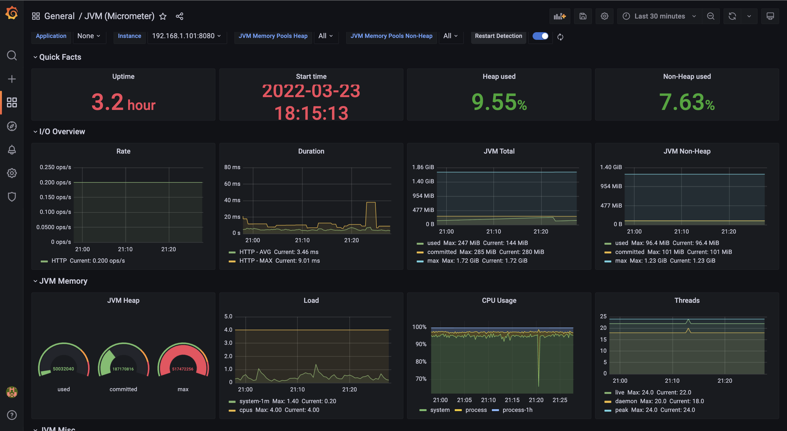
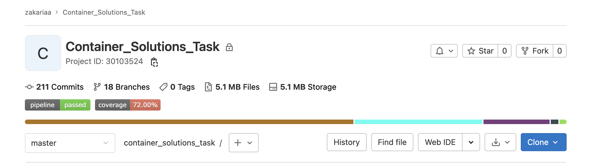

# Description

This application is now more of a learning project or a playground because here is where I'm try out new things. It all started in 2021 when I took part in a Technical assessment from Container Solutions(the project's specifications can be found [here](./api_specifications/) ).

The project is developed using Spring Boot.

## Accomplishments/Features

***It's hard to automate a task that you don't know how to do manually***

- The code is presented as if this were work you would do for a client and you were given this brief.
- The code run in 1 or 2 commands—this project needs to be deployment ready and run it a cloud or local environment with as little effort as possible.
- The API is conform to the specifications (correct endpoints and it should work well and it should run on any machine).
- Tried more advanced stuff in the Dockerfile: multi-stage Dockerfile, skinny Docker image, important part is multi-stage Dockerfile, correct tag usage, caching effectiveness, recommend user ID; not run as root, exposing ports.
- Tried some advanced stuff in kubernetes, eg: secrets in K8s.
- Translate the given CSV file [titanic.csv] to a SQL file , I used [this website](https://www.convertcsv.com/csv-to-sql.htm) to proceed with the conversion.
- Replace integer for uuid by the randomized uuid string.
- Added a trigger for the data.sql to add a random uuid (_equivalent of AutoIncrement for a normal id_).
- Add Integration tests and Unit tests.
- Add a swagger UI as the one given in [swagger.yml].
- Use Storage to store inserted/updated/deleted data ( Volume for docker, PVC for kubernetes ).
- Clean K8s architecture ( DB / App separate).
- No need to use init container(k8s) to import data as it's done automatically.
- Implemented a CI/CD pipeline using Gitlab CI.
- Scan the Docker image for security vulnerabilities.
- Configure a monitoring system using Prometheus.

## Run it using docker-compose
In my docker-compose file I used :
- Two services ( mysqldb , app )
- A SQL file (data.sql) that inserts data on startup
- Multi-stage Dockerfile with skinny Docker images **maven:3.8.4-jdk-8-slim && openjdk:8-jre-slim**
- Exposing ports (in dockerfile for Spring-boot-app , and in docker-compose file for MySQL database)
- Volume for MySQL database
- Env file **.env** to store some data ( ports, db_username, db_password, db_name )
- Restart policies

> To launch the project using docker-compose use the bash script :
```bash
./build-docker-compose.sh
```

## Run it using kubernetes
In my k8s-deployment file I used:
- Deployment for our Spring boot app
- StatefulSet for our mysql database
- PV && PVC to store data locally (_not recommended for production use !!_)
- Secret to store sensitive data (mainly passwords )
- Services to expose our deployment ( I use it locally )
- A SQL file (data.sql) that inserts data on startup (**No need to use initContainer to import data**)
- An Ingress for external access to the service in a my local cluster (_I used Ingress locally // Docker Desktop_)

> To launch the project using kubernetes use the bash script :
use the bash script:
````bash
kubectl apply -f persistentvolume.yaml
kubectl apply -f persistentvolumeclaim.yaml
````
> And then do run this script:
```bash
./build-k8s-deployment.sh
```
• To be able to enable the Nginx Ingress , we do :
1. Deploy ingress Nginx by command
```bash
kubectl apply -f https://raw.githubusercontent.com/kubernetes/ingress-nginx/controller-v0.43.0/deploy/static/provider/cloud/deploy.yaml
```
2. Then manually adding my ingress hostname to /etc/hosts:
```bash
    127.0.0.1     my-rest-api.zakariaa.sadek.com
```
3. Apply my ingress.yaml file using 
```bash
    kubectl deploy -f ingress.yaml
```
4. When the ingress controller starts, the SSL Certificate is created.
5. Then you can access through url .
> To get All
https://my-rest-api.zakariaa.sadek.com/people


> To get a simple people
https://my-rest-api.zakariaa.sadek.com/people/041e8e7d-2e9c-11ec-84db-babf5c0a104c

## Run it using helm-Charts
In my helm folder I used:
- Chart app which contains our spring boot application
- Chart database which contains mysql database
- I used the **Helm umbrella charts** as a powerful way of installing multiple components as a single one. 
- Defined Helm dependencies condition ( the application need to have the db before it )

> To launch the project using helm charts use the bash script :
use the bash script 
```bash
./build-helm-chart.sh
```
## Run it using Terraform
This is a simple example to show how to use Terraform in to deploy our application using Kubernetes.
1. Define the Terraform provider file and specify the kubernetes host address.

> Since I am using my local machine I used the command below to get my kubernetes configuration
```bash
    kubectl config view
```
2. Define the Terraform deployment (**main.tf**) file to define the Kubernetes resource (Secrets+Deployment+StatfulSet+Services+PersistentVolume,PersistentVolumeClaim and Ingress).
3. Deploy the kubernetes resources using Terraform

```bash
    terraform apply
```
4. Destroy the kubernetes resources using Terraform

```bash
    terraform destroy
```
**NB:**
- To have a good working Ingress , it's recommended to enable Nginx Ingress by 
```bash
kubectl apply -f https://raw.githubusercontent.com/kubernetes/ingress-nginx/controller-v0.43.0/deploy/static/provider/cloud/deploy.yaml
```
- Then manually adding my ingress hostname to /etc/hosts:
```bash
    127.0.0.1     my-rest-api.zakariaa.sadek.com
```

- And then the application will be accessible through https://my-rest-api.zakariaa.sadek.com/people/

```
### Terraform Graph

> Terraform build a graph as a part of its plan , we can actually get some insight into what's going to happen by exporting that graph and rendering it visually. 
The command to do this is just :
```bash
terraform graph
```
To see the graph , I copied the result of the above command and use [this website](http://www.webgraphviz.com/) . The result is in for our case :



## Swagger
I used it to visualize and describe the structure of our REST API, and with Swagger UI it provides online sandbox for frontend developers by helping them to automatically build a good and interactive API documentation
> To Open Swagger page use 
http://localhost:8080/swagger-ui.html
The result will be something like : 




## Monitoring and Alerting
It is important to monitor an application’s metrics and health which helps us to improve performance, manage the app in a better way, and notice unoptimized behavior.
I managed to monitor my application using ***Micrometer*** which exposes metrics from our application, ***Prometheus*** which stores the metric data, and ***Grafana*** to visualize the data in graphs.

- If we run the application we can see that our custom metrics are exposed via the actuatuor/prometheus endpoint


- As we now have the metrics available in a format that Prometheus can understand,we set up Prometheus.
> To check that Prometheus is correctly listening to our locally running Spring Boot application we can navigate to **Status -> Targets** in the top main navigation bar:


- Grafana can pull data from various data sources like Prometheus, Elasticsearch, InfluxDB, etc. It also allows you to set rule-based alerts, which then can notify you over Slack, Email (**TBD**).
After importing [JVM Dashboard](https://grafana.com/grafana/dashboards/4701) , we can visualize metrics from Grafana’s dashboard


## CI/CD pipeline
Yeah my project has also a ci/cd pipepline , it's not finished yet , but let me explain.
In this part , I tried to test the most popular tools (Gitlab CI , GitHub Actions and Jenkins)

- Jenkins = : Just started but needs more enhancements
- GitHub Actions : To Be Done
- Gitlab CI : Fun starts here , I managed to create a simple pipeline in which I focused more on the CI part of the job. The pipepline is in ***.gitlab-ci.yml*** file,it contains four stages : 
    1. build: Build the project and generate its artifact (Jar file)
    2. test: Has five parallel steps:
        1. unit_test : Performed unit tests
        2. integration_test : Performed integration tests
        3. dependency_scanning: Analyses the dependencies in the published vulnerability database and provides a report.
        4. smoke_test: To determines whether the deployed app build is stable or not.
        5. code_coverage: Monitor the quality of testing, create tests that are missing or not validated.
    3. gitLab_pages: Used in master only, we take report from dependency_scanning step and publish it as a GitLab Badge  
    4. docker: Build Multi-Architecture Docker Images With Buildx and push them to both [Gitlab registry](https://gitlab.com/zakariaa_sadek/container_solutions_task/container_registry) and [Docker registry](https://hub.docker.com/repository/docker/zakariaasadek/container_solutions_task)
    5. scan: Scan the created Docker image for security vulnerabilities , I used for that [trivy](https://github.com/aquasecurity/trivy) which is a scanner for vulnerabilities in container images,file systems, and Git repositories

It's All good in Gitlab:


## TODO List
Trying to add more cool stuff to this project , stay tuned.
- Create Github actions pipeline
- Create Jenkins pipeline
- Alerting through Slack or Email
- Enable Logging
- Use Terraform to automatically bootstrap the whole infrastructure
- Deploy my application in AWS or GCP or Even Azure

Please feel free to add something that can enhance this project. 

## Acknowledgement:

This project stems from my desire to improve my knowledge through building effecient Infrastructure. 
Knowing that this application could also help someone, that motivated me even more 

# Maintainer
**Zakariaa SADEK**
